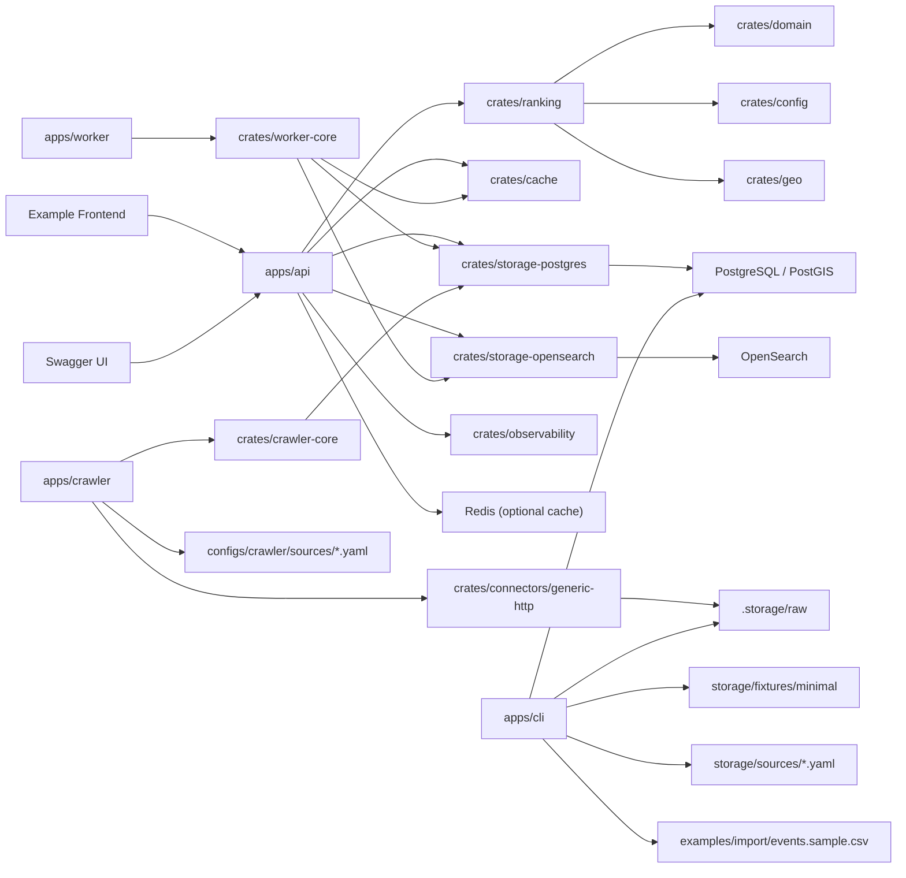

# Architecture

## Current Boundaries

- PostgreSQL/PostGIS remains the source of truth.
- Placement profiles are config-driven and loaded at startup.
- Reference profile packs in `configs/profiles` own demo/source mapping,
  reason-label layering, and profile fixture references without changing runtime
  ranking semantics.
- Redis stays cache only and can be disabled without changing correctness.
- OpenSearch remains optional and candidate-retrieval-only.
- Allowlist crawl is optional and does not gate API, worker, or CSV import availability.
- Final ranking, explanation, mixed content selection, and diversity control stay in Rust.
- Operational event CSV is staged under `.storage/raw/` and imported idempotently into PostgreSQL.
- Crawl fetches stage raw HTML under `.storage/raw/`, keep parser choice in a registry, and write fetch / parse / dedupe audit tables in PostgreSQL.
- `search_execute` now feeds popularity and area snapshot weights through `target_station_id` to station-link expansion, with calibration owned by `configs/ranking/tracking.default.yaml`.
- Area and line adjacency tables are PostgreSQL reference data for future
  `GeoGraph` / `LineGraph` expansion. They are read through the storage
  contract and do not change ranking weights, crawler behavior, or dynamic
  connector loading by themselves. The storage contract exposes canonical
  read-only `GeoGraph` / `LineGraph` components that normalize deterministic
  edge ordering and provide diagnostics for observed area clusters, station
  hops, and interchange groups.
- The graph-aware candidate plan slice is active in the PostgreSQL candidate
  path. The API loads the `GeoGraph` / `LineGraph` read models for the resolved
  area and line origins, uses normalized adjacent id sets as deterministic
  candidate expansion hints, and persists compact `graph_diagnostics` in
  dedicated candidate plan trace rows. Line adjacency is scoped by the neighbor
  distance and hop caps before it can feed the `same_line` stage. Area adjacency
  can feed `neighbor_area`. Ranking weights, crawler behavior, and dynamic
  connector loading remain unchanged. The persisted diagnostics use counts plus
  capped samples rather than full per-edge graph details or expanded candidate
  ids.
- Session context summaries are PostgreSQL diagnostic/reference data keyed by a
  hashed session identifier. They are read through the storage contract and do
  not change ranking, crawler, or connector runtime behavior by themselves.

## Runtime view

## Recommendation flow

1. `POST /v1/recommendations` receives a target station plus placement.
2. The API builds a cache key from the serialized request payload plus profile version, algorithm version, retrieval mode, candidate limit, and fallback `neighbor_distance_cap_meters`.
3. The API loads graph expansion hints for the resolved area and line origins.
4. Candidate links come from PostgreSQL (`sql_only`) or OpenSearch (`full`).
   PostgreSQL retrieval consumes the graph hints directly; OpenSearch remains
   candidate-retrieval-only and falls back to PostgreSQL when it returns too
   few candidates.
5. PostgreSQL loads school rows, active event rows, station rows, and snapshot
   rows for the candidate slice.
6. `crates/ranking` scores school candidates and event candidates from the same
   slice, using the same graph hints for deterministic fallback-stage planning.
7. Placement config applies mixed-ranking boosts and diversity hard caps.
8. When diversity caps remove candidates from the display list, the response
   explanation names the affected cap family without changing the score math.
9. The response returns mixed items, explanation text, profile version, and
   algorithm version.

## Mixed ranking model

- `school`
  One best station-linked item per school.
- `event`
  Active event rows that belong to candidate schools and are visible to the requested placement.
- `article`
  Reserved in config and schema, but runtime validation still rejects it until article candidates are implemented.

Article support is deliberately a foundation contract today, not a partial
runtime path. Profile manifests now declare content-kind identifiers through a
profile-owned `content_kinds` registry and expose runtime refs through
`supported_content_kinds`, while `ContentKind::Article` remains a compatibility
adapter for the current response/config reservation. Active profile packs must
keep `article_support: reserved`. They may list `article` in the
`content_kinds` registry as a future kind, but must not list it in
`supported_content_kinds`, and placement configs must not reference `article`
in `enabled_content_kinds`, `score_boosts`, or `content_kind_max_ratio`.
Validation and doctor output separate registry-only kinds from the currently
executable `school,event` runtime boundary. Turning it on requires a small
reviewed slice that adds an article read model, dataset loading, deterministic
scoring, diversity tests, fixtures, and public API/OpenAPI docs if the response
shape changes.

Per-placement config currently controls:

- neighbor expansion tolerance
- same-line neighbor bonus
- per-content-kind score boosts
- featured event bonus
- event priority weight
- same school cap
- same group cap
- per-content-kind max ratio

## Diversity model

Selection happens after scoring.

- `same_school_cap`
  Limits repeated items from the same school across school and event content.
- `same_group_cap`
  Limits repeated items from the same school group.
- `content_kind_max_ratio`
  Limits how much of the final list can be occupied by one content kind.

The ranker may return fewer than the requested limit when the hard caps would otherwise be violated.

## Reference profile packs

- `local-discovery-generic` is the small SQL-only demo profile backed by
  `storage/fixtures/minimal`.
- `school-event-jp` is the maintained JP school/event reference profile backed
  by JP adapter manifests, event CSV examples, and optional crawler examples.
- Profile packs are validated local manifests, not dynamic plugins. They do not
  make crawling, full mode, OpenSearch, or managed infrastructure mandatory.

## Import model

- JP importers still use source manifests plus normalized tables.
- Operational event CSV uses direct file import through `cargo run -p cli -- import event-csv --file ...`.
- Operational event NDJSON uses direct file import through `cargo run -p cli -- import event-ndjson --file ...`.
- Profile-declared one-shot imports can be run through
  `cargo run -p cli -- import profile-source --source-id ...`, which resolves
  local connector paths and the deterministic `event_v1` field mapping from the
  selected profile pack. Profile-source runs record the selected profile
  manifest lineage and connector metadata on `import_runs`.
- Raw CSV/NDJSON files are checksum-staged under `.storage/raw/<source-id>/...`.
- The importer uses stable logical source keys such as `event-csv` and `event-ndjson` so renamed operational exports still deactivate stale rows from the same feed.
- Import success and failure are recorded in `import_runs`, `import_run_files`, and `import_reports`.
- Allowlist crawl uses `cargo run -p crawler -- fetch|parse --manifest ...`.
- Fetch writes raw HTML into `.storage/raw/<source_id>/<checksum>/...`.
- Parse uses the registry-selected parser, records parse failures explicitly, dedupes deterministic event IDs, and imports rows into `events` as `source_type = 'crawl'` with manifest `source_id` as the stable source key. Parser details such as detail, official, or apply URLs are preserved in `events.details`.
- Crawl success and failure are recorded in `crawl_runs`, `crawl_fetch_logs`, `crawl_parse_reports`, and `crawl_dedupe_reports`. `crawl_runs` carries the same nullable profile/connector lineage fields for operator evidence, without making profile packs or crawling mandatory.

## Workspace Crate Map

- `crates/domain`
  Placement enum, content-kind enum, mixed recommendation item types, and ranking query/result shapes.
- `crates/config`
  Placement profile loading, strict config parsing, and startup validation.
- `crates/ranking`
  Mixed school/event scoring, explanation synthesis, and diversity selection.
- `crates/storage`
  Storage contracts for recommendation reads/writes, traces, profile registry
  records, reference graph adjacency reads, and session context summary reads.
- `crates/connectors/generic-csv`
  Checksum staging plus direct CSV staging for operational event import.
- `crates/connectors/generic-http`
  Allowlist URL validation, robots evaluation, HTTP fetch, and raw HTML staging.
- `crates/crawler-core`
  Crawl manifest loading, parser registry, HTML extraction, deterministic event IDs, and dedupe logic.
- `crates/storage-postgres`
  Placement-aware dataset loading, event CSV import, crawl audit persistence, and fixture seeding.
- `apps/api`
  Placement-aware recommendation endpoint and updated response contract.
- `apps/cli`
  `import event-csv`, existing JP imports, and projection commands.
- `apps/crawler`
  `fetch`, `parse`, `run`, and `serve` commands for optional allowlist crawl.
