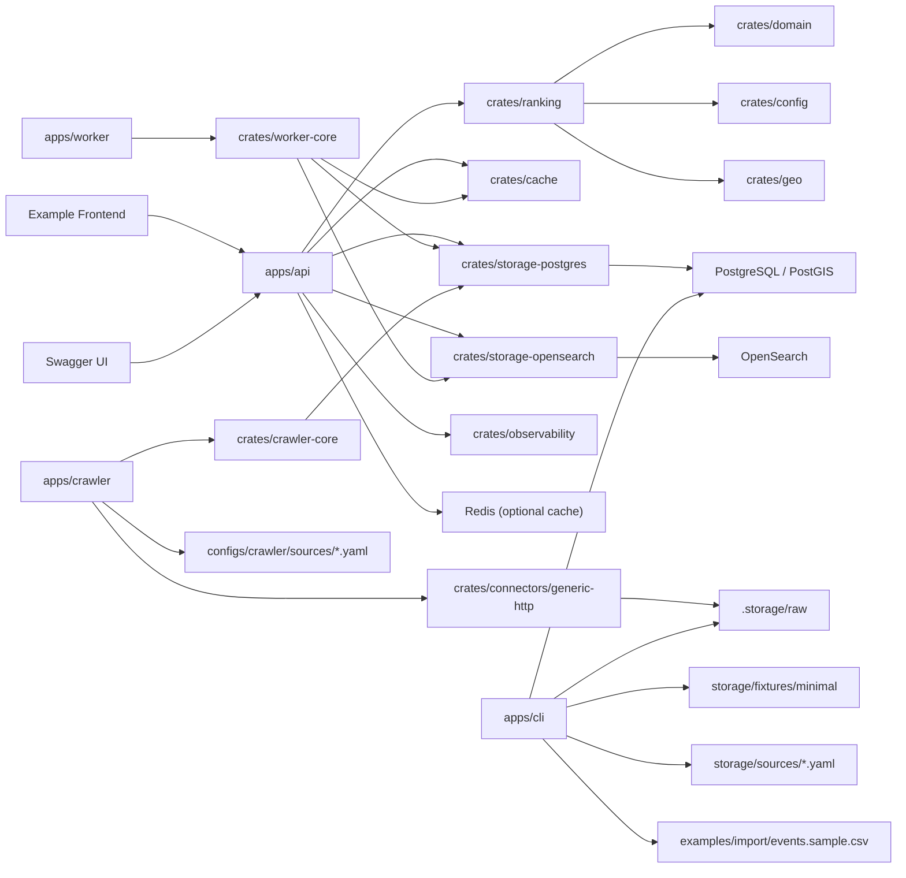

# Architecture

## Phase 6 boundaries

- PostgreSQL/PostGIS remains the source of truth.
- Placement profiles are config-driven and loaded at startup.
- Reference profile packs in `configs/profiles` own demo/source mapping,
  reason-label layering, and profile fixture references without changing runtime
  ranking semantics.
- Redis stays cache only and can be disabled without changing correctness.
- OpenSearch remains optional and candidate-retrieval-only.
- Allowlist crawl is optional and does not gate API, worker, or CSV import availability.
- Final ranking, explanation, mixed content selection, and diversity control stay in Rust.
- Operational event CSV is staged under `.storage/raw/` and imported idempotently into PostgreSQL.
- Crawl fetches stage raw HTML under `.storage/raw/`, keep parser choice in a registry, and write fetch / parse / dedupe audit tables in PostgreSQL.
- `search_execute` now feeds popularity and area snapshot weights through `target_station_id` to station-link expansion, with calibration owned by `configs/ranking/tracking.default.yaml`.

## Runtime view

## Recommendation flow

1. `POST /v1/recommendations` receives a target station plus placement.
2. The API builds a cache key from the serialized request payload plus profile version, algorithm version, retrieval mode, candidate limit, and fallback `neighbor_distance_cap_meters`.
3. Candidate links come from PostgreSQL (`sql_only`) or OpenSearch (`full`).
4. PostgreSQL loads school rows, active event rows, station rows, and snapshot rows for the candidate slice.
5. `crates/ranking` scores school candidates and event candidates from the same slice.
6. Placement config applies mixed-ranking boosts and diversity hard caps.
7. When diversity caps remove candidates from the display list, the response explanation names the affected cap family without changing the score math.
8. The response returns mixed items, explanation text, profile version, and algorithm version.

## Mixed ranking model

- `school`
  One best station-linked item per school.
- `event`
  Active event rows that belong to candidate schools and are visible to the requested placement.
- `article`
  Reserved in config and schema, but runtime validation still rejects it until article candidates are implemented.

Per-placement config currently controls:

- neighbor expansion tolerance
- same-line neighbor bonus
- per-content-kind score boosts
- featured event bonus
- event priority weight
- same school cap
- same group cap
- per-content-kind max ratio

## Diversity model

Selection happens after scoring.

- `same_school_cap`
  Limits repeated items from the same school across school and event content.
- `same_group_cap`
  Limits repeated items from the same school group.
- `content_kind_max_ratio`
  Limits how much of the final list can be occupied by one content kind.

The ranker may return fewer than the requested limit when the hard caps would otherwise be violated.

## Reference profile packs

- `local-discovery-generic` is the small SQL-only demo profile backed by
  `storage/fixtures/minimal`.
- `school-event-jp` is the maintained JP school/event reference profile backed
  by JP adapter manifests, event CSV examples, and optional crawler examples.
- Profile packs are validated local manifests, not dynamic plugins. They do not
  make crawling, full mode, OpenSearch, or managed infrastructure mandatory.

## Import model

- JP importers still use source manifests plus normalized tables.
- Operational event CSV uses direct file import through `cargo run -p cli -- import event-csv --file ...`.
- Raw CSV is checksum-staged under `.storage/raw/event-csv/...`.
- The importer uses a stable logical source key (`event-csv`) so renamed operational exports still deactivate stale rows from the same feed.
- Import success and failure are recorded in `import_runs`, `import_run_files`, and `import_reports`.
- Allowlist crawl uses `cargo run -p crawler -- fetch|parse --manifest ...`.
- Fetch writes raw HTML into `.storage/raw/<source_id>/<checksum>/...`.
- Parse uses the registry-selected parser, records parse failures explicitly, dedupes deterministic event IDs, and imports rows into `events` as `source_type = 'crawl'` with manifest `source_id` as the stable source key.
- Crawl success and failure are recorded in `crawl_runs`, `crawl_fetch_logs`, `crawl_parse_reports`, and `crawl_dedupe_reports`.

## Phase 6 crate map

- `crates/domain`
  Placement enum, content-kind enum, mixed recommendation item types, and ranking query/result shapes.
- `crates/config`
  Placement profile loading, strict config parsing, and startup validation.
- `crates/ranking`
  Mixed school/event scoring, explanation synthesis, and diversity selection.
- `crates/connectors/generic-csv`
  Checksum staging plus direct CSV staging for operational event import.
- `crates/connectors/generic-http`
  Allowlist URL validation, robots evaluation, HTTP fetch, and raw HTML staging.
- `crates/crawler-core`
  Crawl manifest loading, parser registry, HTML extraction, deterministic event IDs, and dedupe logic.
- `crates/storage-postgres`
  Placement-aware dataset loading, event CSV import, crawl audit persistence, and fixture seeding.
- `apps/api`
  Placement-aware recommendation endpoint and updated response contract.
- `apps/cli`
  `import event-csv`, existing JP imports, and projection commands.
- `apps/crawler`
  `fetch`, `parse`, `run`, and `serve` commands for optional allowlist crawl.
